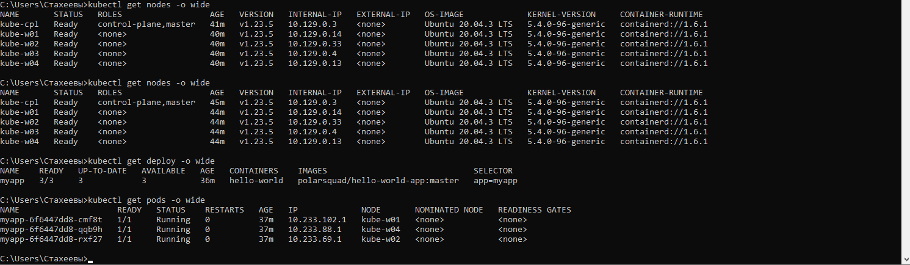
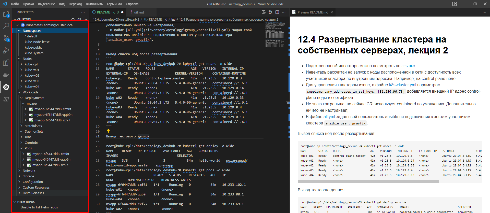

# 12.4 Развертывание кластера на собственных серверах, лекция 2

- Подготовленный инвентарь можно посмотреть по [ссылке](inventory/netology) 
- Инвентарь рассчитан на запуск с ноды расположенной в сети с доступность всех участников кластера по внутренним адресам. Например, на control-plane ноде;
- Для управления кластером извне, в файле [k8s-cluster.yml](inventory/netology/group_vars/k8s_cluster/k8s-cluster.yml) параметром `supplementary_addresses_in_ssl_keys: [51.250.96.73]` добавляется внешний IP адрес control-plane ноды в сертификат;
- Не знаю как раньше, но сейчас CRI использует containerd по умолчанию. Дополнительно ничего не настраивал;
- В файле [all.yml](inventory/netology/group_vars/all/all.yml) задан свой пользователь ansible ля подключения к хостам участникам кластера `ansible_user: grayfix`.


Вывод списка нод после развертывания:
```
root@kube-cpl:/data/netology_devkub-7# kubectl get nodes -o wide
NAME       STATUS   ROLES                  AGE   VERSION   INTERNAL-IP   EXTERNAL-IP   OS-IMAGE             KERNEL-VERSION     CONTAINER-RUNTIME
kube-cpl   Ready    control-plane,master   42m   v1.23.5   10.129.0.3    <none>        Ubuntu 20.04.3 LTS   5.4.0-96-generic   containerd://1.6.1
kube-w01   Ready    <none>                 41m   v1.23.5   10.129.0.14   <none>        Ubuntu 20.04.3 LTS   5.4.0-96-generic   containerd://1.6.1
kube-w02   Ready    <none>                 41m   v1.23.5   10.129.0.33   <none>        Ubuntu 20.04.3 LTS   5.4.0-96-generic   containerd://1.6.1
kube-w03   Ready    <none>                 41m   v1.23.5   10.129.0.4    <none>        Ubuntu 20.04.3 LTS   5.4.0-96-generic   containerd://1.6.1
kube-w04   Ready    <none>                 41m   v1.23.5   10.129.0.13   <none>        Ubuntu 20.04.3 LTS   5.4.0-96-generic   containerd://1.6.1
```

Вывод тестового деплоя
```
root@kube-cpl:/data/netology_devkub-7# kubectl get deploy -o wide
NAME    READY   UP-TO-DATE   AVAILABLE   AGE   CONTAINERS    IMAGES                              SELECTOR
myapp   3/3     3            3           34m   hello-world   polarsquad/hello-world-app:master   app=myapp
root@kube-cpl:/data/netology_devkub-7# kubectl get pods -o wide
NAME                    READY   STATUS    RESTARTS   AGE   IP             NODE       NOMINATED NODE   READINESS GATES
myapp-6f6447dd8-cmf8t   1/1     Running   0          34m   10.233.102.1   kube-w01   <none>           <none>
myapp-6f6447dd8-qqb9h   1/1     Running   0          34m   10.233.88.1    kube-w04   <none>           <none>
myapp-6f6447dd8-rxf27   1/1     Running   0          34m   10.233.69.1    kube-w02   <none>           <none>
```

Скриншот подключения к кластеру из командной строки Windows по внешнему IP


Скриншот подключения к кластеру из VS Code по внешнему IP

