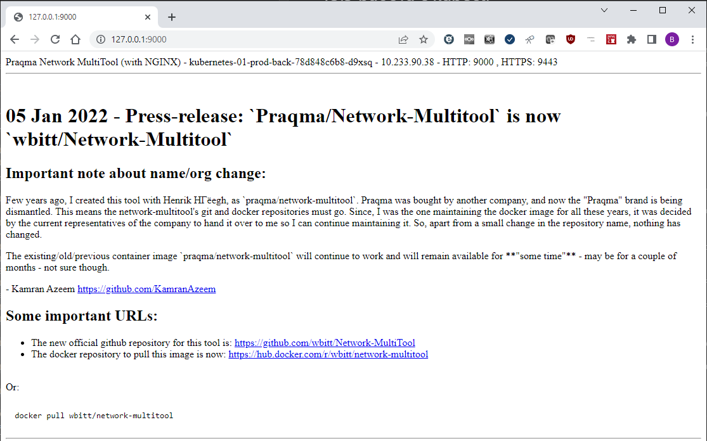
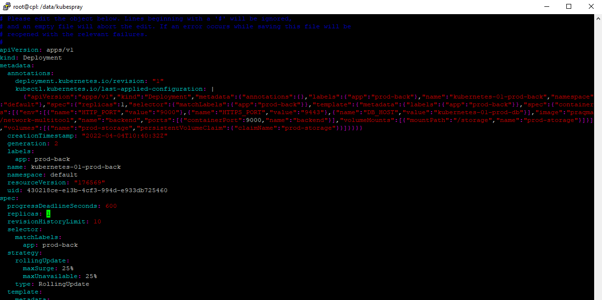
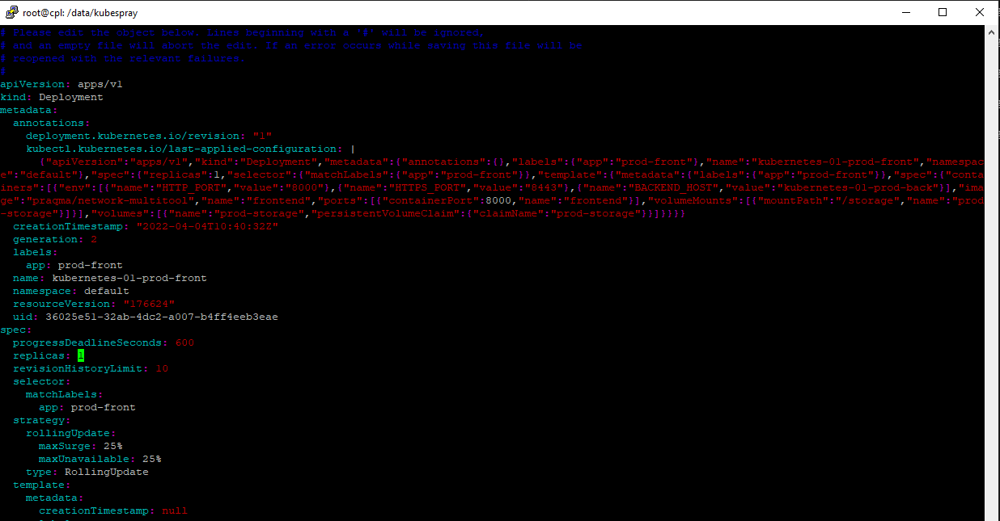

# 13.3 работа с kubectl


1. Работоспособность port-forward и exec
  - Примечание. Т.к. Yandex Cloud меняет внешние IP при перезапуске хоста кластер Kubernetes подключен к локальной машине по SSH туннелю. Поэтому обращение из  Windows идет на localhost.
  - `port-forward -v9 kubernetes-01-prod-back-78d848c6b8-d9xsq 9000` :
    ```
    C:\Users\Стахеевы>kubectl port-forward -v9 svc/kubernetes-01-prod-back 9000
    I0405 15:46:58.601959    3952 loader.go:372] Config loaded from file:  C:\Users\Стахеевы\.kube\config
    I0405 15:46:58.624867    3952 round_trippers.go:466] curl -v -XGET  -H "Accept: application/json, */*" -H "User-Agent: kubectl/v1.23.0 (windows/amd64) kubernetes/ab69524" 'https://127.0.0.1:6443/api/v1/namespaces/default/services/kubernetes-01-prod-back'
    I0405 15:46:58.625843    3952 round_trippers.go:510] HTTP Trace: Dial to tcp:127.0.0.1:6443 succeed
    I0405 15:46:58.731061    3952 round_trippers.go:570] HTTP Statistics: DNSLookup 0 ms Dial 0 ms TLSHandshake 70 ms ServerProcessing 33 ms Duration 106 ms
    I0405 15:46:58.731061    3952 round_trippers.go:577] Response Headers:
    I0405 15:46:58.731061    3952 round_trippers.go:580]     X-Kubernetes-Pf-Flowschema-Uid: 5baa8ffa-ec03-4a5f-8030-b70b5acdaa5d
    I0405 15:46:58.731061    3952 round_trippers.go:580]     X-Kubernetes-Pf-Prioritylevel-Uid: ee56c3d4-b213-496b-991a-915e2b06aeae
    I0405 15:46:58.731563    3952 round_trippers.go:580]     Content-Length: 1384
    I0405 15:46:58.731573    3952 round_trippers.go:580]     Date: Tue, 05 Apr 2022 10:46:58 GMT
    I0405 15:46:58.731573    3952 round_trippers.go:580]     Audit-Id: 907d9907-99af-4168-b7f7-b9fab1f409c2
    I0405 15:46:58.731573    3952 round_trippers.go:580]     Cache-Control: no-cache, private
    I0405 15:46:58.731573    3952 round_trippers.go:580]     Content-Type: application/json
    I0405 15:46:58.731573    3952 request.go:1181] Response Body: {"kind":"Service","apiVersion":"v1","metadata":{"name":"kubernetes-01-prod-back","namespace":"default","uid":"0fce7e2a-f280-45cf-88d9-afa44c8bfb30","resourceVersion":"38145","creationTimestamp":"2022-04-04T10:40:32Z","annotations":{"kubectl.kubernetes.io/last-applied-configuration":"{\"apiVersion\":\"v1\",\"kind\":\"Service\",\"metadata\":{\"annotations\":{},\"name\":\"kubernetes-01-prod-back\",\"namespace\":\"default\"},\"spec\":{\"ports\":[{\"name\":\"backend\",\"port\":9000,\"protocol\":\"TCP\"}],\"selector\":{\"app\":\"prod-back\"},\"type\":\"ClusterIP\"}}\n"},"managedFields":[{"manager":"kubectl-client-side-apply","operation":"Update","apiVersion":"v1","time":"2022-04-04T10:40:32Z","fieldsType":"FieldsV1","fieldsV1":{"f:metadata":{"f:annotations":{".":{},"f:kubectl.kubernetes.io/last-applied-configuration":{}}},"f:spec":{"f:internalTrafficPolicy":{},"f:ports":{".":{},"k:{\"port\":9000,\"protocol\":\"TCP\"}":{".":{},"f:name":{},"f:port":{},"f:protocol":{},"f:targetPort":{}}},"f:selector":{},"f:sessionAffinity":{},"f:type":{}}}}]},"spec":{"ports":[{"name":"backend","protocol":"TCP","port":9000,"targetPort":9000}],"selector":{"app":"prod-back"},"clusterIP":"10.233.54.17","clusterIPs":["10.233.54.17"],"type":"ClusterIP","sessionAffinity":"None","ipFamilies":["IPv4"],"ipFamilyPolicy":"SingleStack","internalTrafficPolicy":"Cluster"},"status":{"loadBalancer":{}}}
    I0405 15:46:58.732592    3952 round_trippers.go:466] curl -v -XGET  -H "Accept: application/json, */*" -H "User-Agent: kubectl/v1.23.0 (windows/amd64) kubernetes/ab69524" 'https://127.0.0.1:6443/api/v1/namespaces/default/pods?labelSelector=app%3Dprod-back'
    I0405 15:46:58.767131    3952 round_trippers.go:570] HTTP Statistics: GetConnection 0 ms ServerProcessing 33 ms Duration 33 ms
    I0405 15:46:58.767131    3952 round_trippers.go:577] Response Headers:
    I0405 15:46:58.767131    3952 round_trippers.go:580]     Audit-Id: f2b689ed-8fb8-40fc-bc6f-322dd15548e9
    I0405 15:46:58.767131    3952 round_trippers.go:580]     Cache-Control: no-cache, private
    I0405 15:46:58.767131    3952 round_trippers.go:580]     Content-Type: application/json
    I0405 15:46:58.767633    3952 round_trippers.go:580]     X-Kubernetes-Pf-Flowschema-Uid: 5baa8ffa-ec03-4a5f-8030-b70b5acdaa5d
    I0405 15:46:58.767643    3952 round_trippers.go:580]     X-Kubernetes-Pf-Prioritylevel-Uid: ee56c3d4-b213-496b-991a-915e2b06aeae
    I0405 15:46:58.767643    3952 round_trippers.go:580]     Date: Tue, 05 Apr 2022 10:46:58 GMT
    I0405 15:46:58.767643    3952 request.go:1181] Response Body: {"kind":"PodList","apiVersion":"v1","metadata":{"resourceVersion":"175974"},"items":[{"metadata":{"name":"kubernetes-01-prod-back-78d848c6b8-d9xsq","generateName":"kubernetes-01-prod-back-78d848c6b8-","namespace":"default","uid":"e2dca006-5577-437c-9388-942cff08c7b5","resourceVersion":"171447","creationTimestamp":"2022-04-04T10:40:32Z","labels":{"app":"prod-back","pod-template-hash":"78d848c6b8"},"annotations":{"cni.projectcalico.org/containerID":"1c70825128ea33bfbb870596ce2031701d013c24181b9180e5ef691992eed4ed","cni.projectcalico.org/podIP":"10.233.90.38/32","cni.projectcalico.org/podIPs":"10.233.90.38/32"},"ownerReferences":[{"apiVersion":"apps/v1","kind":"ReplicaSet","name":"kubernetes-01-prod-back-78d848c6b8","uid":"b164fa06-618d-4b01-8a44-88523ffa1977","controller":true,"blockOwnerDeletion":true}],"managedFields":[{"manager":"kube-controller-manager","operation":"Update","apiVersion":"v1","time":"2022-04-04T10:40:32Z","fieldsType":"FieldsV1","fieldsV1":{"f:metadata":{"f:generateName":{},"f:labels":{".":{},"f:app":{},"f:pod-template-hash":{}},"f:ownerReferences":{".":{},"k:{\"uid\":\"b164fa06-618d-4b01-8a44-88523ffa1977\"}":{}}},"f:spec":{"f:containers":{"k:{\"name\":\"backend\"}":{".":{},"f:env":{".":{},"k:{\"name\":\"DB_HOST\"}":{".":{},"f:name":{},"f:value":{}},"k:{\"name\":\"HTTPS_PORT\"}":{".":{},"f:name":{},"f:value":{}},"k:{\"name\":\"HTTP_PORT\"}":{".":{},"f:name":{},"f:value":{}}},"f:image":{},"f:imagePullPolicy":{},"f:name":{},"f:ports":{".":{},"k:{\"containerPort\":9000,\"protocol\":\"TCP\"}":{".":{},"f:containerPort":{},"f:name":{},"f:protocol":{}}},"f:resources":{},"f:terminationMessagePath":{},"f:terminationMessagePolicy":{},"f:volumeMounts":{".":{},"k:{\"mountPath\":\"/storage\"}":{".":{},"f:mountPath":{},"f:name":{}}}}},"f:dnsPolicy":{},"f:enableServiceLinks":{},"f:restartPolicy":{},"f:schedulerName":{},"f:securityContext":{},"f:terminationGracePeriodSeconds":{},"f:volumes":{".":{},"k:{\"name\":\"prod-storage\"}":{".":{},"f:name":{},"f:persistentVolumeClaim":{".":{},"f:claimName":{}}}}}}},{"manager":"calico","operation":"Update","apiVersion":"v1","time":"2022-04-04T10:46:45Z","fieldsType":"FieldsV1","fieldsV1":{"f:metadata":{"f:annotations":{".":{},"f:cni.projectcalico.org/containerID":{},"f:cni.projectcalico.org/podIP":{},"f:cni.projectcalico.org/podIPs":{}}}},"subresource":"status"},{"manager":"Go-http-client","operation":"Update","apiVersion":"v1","time":"2022-04-05T10:11:38Z","fieldsType":"FieldsV1","fieldsV1":{"f:status":{"f:conditions":{"k:{\"type\":\"ContainersReady\"}":{".":{},"f:lastProbeTime":{},"f:lastTransitionTime":{},"f:status":{},"f:type":{}},"k:{\"type\":\"Initialized\"}":{".":{},"f:lastProbeTime":{},"f:lastTransitionTime":{},"f:status":{},"f:type":{}},"k:{\"type\":\"Ready\"}":{".":{},"f:lastProbeTime":{},"f:lastTransitionTime":{},"f:status":{},"f:type":{}}},"f:containerStatuses":{},"f:hostIP":{},"f:phase":{},"f:podIP":{},"f:podIPs":{".":{},"k:{\"ip\":\"10.233.90.38\"}":{".":{},"f:ip":{}}},"f:startTime":{}}},"subresource":"status"}]},"spec":{"volumes":[{"name":"prod-storage","persistentVolumeClaim":{"claimName":"prod-storage"}},{"name":"kube-api-access-ckpfl","projected":{"sources":[{"serviceAccountToken":{"expirationSeconds":3607,"path":"token"}},{"configMap":{"name":"kube-root-ca.crt","items":[{"key":"ca.crt","path":"ca.crt"}]}},{"downwardAPI":{"items":[{"path":"namespace","fieldRef":{"apiVersion":"v1","fieldPath":"metadata.namespace"}}]}}],"defaultMode":420}}],"containers":[{"name":"backend","image":"praqma/network-multitool","ports":[{"name":"backend","containerPort":9000,"protocol":"TCP"}],"env":[{"name":"HTTP_PORT","value":"9000"},{"name":"HTTPS_PORT","value":"9443"},{"name":"DB_HOST","value":"kubernetes-01-prod-db"}],"resources":{},"volumeMounts":[{"name":"prod-storage","mountPath":"/storage"},{"name":"kube-api-access-ckpfl","readOnly":true,"mountPath":"/var/run/secrets/kubernetes.io/serviceaccount"}],"terminationMessagePath":"/dev/termination-log","terminationMessagePolicy":"File","imagePullPolicy":"Always"}],"restartPolicy":"Always","terminationGracePeriodSeconds":30,"dnsPolicy":"ClusterFirst","serviceAccountName":"default","serviceAccount":"default","nodeName":"node1","securityContext":{},"schedulerName":"default-scheduler","tolerations":[{"key":"node.kubernetes.io/not-ready","operator":"Exists","effect":"NoExecute","tolerationSeconds":300},{"key":"node.kubernetes.io/unreachable","operator":"Exists","effect":"NoExecute","tolerationSeconds":300}],"priority":0,"enableServiceLinks":true,"preemptionPolicy":"PreemptLowerPriority"},"status":{"phase":"Running","conditions":[{"type":"Initialized","status":"True","lastProbeTime":null,"lastTransitionTime":"2022-04-04T10:40:32Z"},{"type":"Ready","status":"True","lastProbeTime":null,"lastTransitionTime":"2022-04-05T10:11:38Z"},{"type":"ContainersReady","status":"True","lastProbeTime":null,"lastTransitionTime":"2022-04-05T10:11:38Z"},{"type":"PodScheduled","status":"True","lastProbeTime":null,"lastTransitionTime":"2022-04-04T10:40:32Z"}],"hostIP":"10.129.0.11","podIP":"10.233.90.38","podIPs":[{"ip":"10.233.90.38"}],"startTime":"2022-04-04T10:40:32Z","containerStatuses":[{"name":"backend","state":{"running":{"startedAt":"2022-04-05T10:11:37Z"}},"lastState":{"terminated":{"exitCode":255,"reason":"Unknown","startedAt":"2022-04-04T10:46:47Z","finishedAt":"2022-04-05T10:10:12Z","containerID":"containerd://137c9f3420f734e5dc81389d26d3163e822171f9b97b90c0090606d0117edcff"}},"ready":true,"restartCount":1,"image":"docker.io/praqma/network-multitool:latest","imageID":"docker.io/praqma/network-multitool@sha256:97b15098bb72df10f7c4e177b9c0e2435ec459f16e79ab7ae2ed3f1eb0e79d19","containerID":"containerd://44de17cd1471f44a6628d628c33a3b543904d9775098fa0394c4e62a780ae321","started":true}],"qosClass":"BestEffort"}}]}
    I0405 15:46:58.770718    3952 round_trippers.go:466] curl -v -XGET  -H "Accept: application/json, */*" -H "User-Agent: kubectl/v1.23.0 (windows/amd64) kubernetes/ab69524" 'https://127.0.0.1:6443/api/v1/namespaces/default/pods/kubernetes-01-prod-back-78d848c6b8-d9xsq'
    I0405 15:46:58.814213    3952 round_trippers.go:570] HTTP Statistics: GetConnection 0 ms ServerProcessing 42 ms Duration 42 ms
    I0405 15:46:58.814213    3952 round_trippers.go:577] Response Headers:
    I0405 15:46:58.815753    3952 round_trippers.go:580]     Audit-Id: c92d47f1-c09f-4f04-8ee6-5c20b830ce67
    I0405 15:46:58.817852    3952 round_trippers.go:580]     Cache-Control: no-cache, private
    I0405 15:46:58.817852    3952 round_trippers.go:580]     Content-Type: application/json
    I0405 15:46:58.818936    3952 round_trippers.go:580]     X-Kubernetes-Pf-Flowschema-Uid: 5baa8ffa-ec03-4a5f-8030-b70b5acdaa5d
    I0405 15:46:58.818936    3952 round_trippers.go:580]     X-Kubernetes-Pf-Prioritylevel-Uid: ee56c3d4-b213-496b-991a-915e2b06aeae
    I0405 15:46:58.820003    3952 round_trippers.go:580]     Date: Tue, 05 Apr 2022 10:46:58 GMT
    I0405 15:46:58.820528    3952 request.go:1181] Response Body: {"kind":"Pod","apiVersion":"v1","metadata":{"name":"kubernetes-01-prod-back-78d848c6b8-d9xsq","generateName":"kubernetes-01-prod-back-78d848c6b8-","namespace":"default","uid":"e2dca006-5577-437c-9388-942cff08c7b5","resourceVersion":"171447","creationTimestamp":"2022-04-04T10:40:32Z","labels":{"app":"prod-back","pod-template-hash":"78d848c6b8"},"annotations":{"cni.projectcalico.org/containerID":"1c70825128ea33bfbb870596ce2031701d013c24181b9180e5ef691992eed4ed","cni.projectcalico.org/podIP":"10.233.90.38/32","cni.projectcalico.org/podIPs":"10.233.90.38/32"},"ownerReferences":[{"apiVersion":"apps/v1","kind":"ReplicaSet","name":"kubernetes-01-prod-back-78d848c6b8","uid":"b164fa06-618d-4b01-8a44-88523ffa1977","controller":true,"blockOwnerDeletion":true}],"managedFields":[{"manager":"kube-controller-manager","operation":"Update","apiVersion":"v1","time":"2022-04-04T10:40:32Z","fieldsType":"FieldsV1","fieldsV1":{"f:metadata":{"f:generateName":{},"f:labels":{".":{},"f:app":{},"f:pod-template-hash":{}},"f:ownerReferences":{".":{},"k:{\"uid\":\"b164fa06-618d-4b01-8a44-88523ffa1977\"}":{}}},"f:spec":{"f:containers":{"k:{\"name\":\"backend\"}":{".":{},"f:env":{".":{},"k:{\"name\":\"DB_HOST\"}":{".":{},"f:name":{},"f:value":{}},"k:{\"name\":\"HTTPS_PORT\"}":{".":{},"f:name":{},"f:value":{}},"k:{\"name\":\"HTTP_PORT\"}":{".":{},"f:name":{},"f:value":{}}},"f:image":{},"f:imagePullPolicy":{},"f:name":{},"f:ports":{".":{},"k:{\"containerPort\":9000,\"protocol\":\"TCP\"}":{".":{},"f:containerPort":{},"f:name":{},"f:protocol":{}}},"f:resources":{},"f:terminationMessagePath":{},"f:terminationMessagePolicy":{},"f:volumeMounts":{".":{},"k:{\"mountPath\":\"/storage\"}":{".":{},"f:mountPath":{},"f:name":{}}}}},"f:dnsPolicy":{},"f:enableServiceLinks":{},"f:restartPolicy":{},"f:schedulerName":{},"f:securityContext":{},"f:terminationGracePeriodSeconds":{},"f:volumes":{".":{},"k:{\"name\":\"prod-storage\"}":{".":{},"f:name":{},"f:persistentVolumeClaim":{".":{},"f:claimName":{}}}}}}},{"manager":"calico","operation":"Update","apiVersion":"v1","time":"2022-04-04T10:46:45Z","fieldsType":"FieldsV1","fieldsV1":{"f:metadata":{"f:annotations":{".":{},"f:cni.projectcalico.org/containerID":{},"f:cni.projectcalico.org/podIP":{},"f:cni.projectcalico.org/podIPs":{}}}},"subresource":"status"},{"manager":"Go-http-client","operation":"Update","apiVersion":"v1","time":"2022-04-05T10:11:38Z","fieldsType":"FieldsV1","fieldsV1":{"f:status":{"f:conditions":{"k:{\"type\":\"ContainersReady\"}":{".":{},"f:lastProbeTime":{},"f:lastTransitionTime":{},"f:status":{},"f:type":{}},"k:{\"type\":\"Initialized\"}":{".":{},"f:lastProbeTime":{},"f:lastTransitionTime":{},"f:status":{},"f:type":{}},"k:{\"type\":\"Ready\"}":{".":{},"f:lastProbeTime":{},"f:lastTransitionTime":{},"f:status":{},"f:type":{}}},"f:containerStatuses":{},"f:hostIP":{},"f:phase":{},"f:podIP":{},"f:podIPs":{".":{},"k:{\"ip\":\"10.233.90.38\"}":{".":{},"f:ip":{}}},"f:startTime":{}}},"subresource":"status"}]},"spec":{"volumes":[{"name":"prod-storage","persistentVolumeClaim":{"claimName":"prod-storage"}},{"name":"kube-api-access-ckpfl","projected":{"sources":[{"serviceAccountToken":{"expirationSeconds":3607,"path":"token"}},{"configMap":{"name":"kube-root-ca.crt","items":[{"key":"ca.crt","path":"ca.crt"}]}},{"downwardAPI":{"items":[{"path":"namespace","fieldRef":{"apiVersion":"v1","fieldPath":"metadata.namespace"}}]}}],"defaultMode":420}}],"containers":[{"name":"backend","image":"praqma/network-multitool","ports":[{"name":"backend","containerPort":9000,"protocol":"TCP"}],"env":[{"name":"HTTP_PORT","value":"9000"},{"name":"HTTPS_PORT","value":"9443"},{"name":"DB_HOST","value":"kubernetes-01-prod-db"}],"resources":{},"volumeMounts":[{"name":"prod-storage","mountPath":"/storage"},{"name":"kube-api-access-ckpfl","readOnly":true,"mountPath":"/var/run/secrets/kubernetes.io/serviceaccount"}],"terminationMessagePath":"/dev/termination-log","terminationMessagePolicy":"File","imagePullPolicy":"Always"}],"restartPolicy":"Always","terminationGracePeriodSeconds":30,"dnsPolicy":"ClusterFirst","serviceAccountName":"default","serviceAccount":"default","nodeName":"node1","securityContext":{},"schedulerName":"default-scheduler","tolerations":[{"key":"node.kubernetes.io/not-ready","operator":"Exists","effect":"NoExecute","tolerationSeconds":300},{"key":"node.kubernetes.io/unreachable","operator":"Exists","effect":"NoExecute","tolerationSeconds":300}],"priority":0,"enableServiceLinks":true,"preemptionPolicy":"PreemptLowerPriority"},"status":{"phase":"Running","conditions":[{"type":"Initialized","status":"True","lastProbeTime":null,"lastTransitionTime":"2022-04-04T10:40:32Z"},{"type":"Ready","status":"True","lastProbeTime":null,"lastTransitionTime":"2022-04-05T10:11:38Z"},{"type":"ContainersReady","status":"True","lastProbeTime":null,"lastTransitionTime":"2022-04-05T10:11:38Z"},{"type":"PodScheduled","status":"True","lastProbeTime":null,"lastTransitionTime":"2022-04-04T10:40:32Z"}],"hostIP":"10.129.0.11","podIP":"10.233.90.38","podIPs":[{"ip":"10.233.90.38"}],"startTime":"2022-04-04T10:40:32Z","containerStatuses":[{"name":"backend","state":{"running":{"startedAt":"2022-04-05T10:11:37Z"}},"lastState":{"terminated":{"exitCode":255,"reason":"Unknown","startedAt":"2022-04-04T10:46:47Z","finishedAt":"2022-04-05T10:10:12Z","containerID":"containerd://137c9f3420f734e5dc81389d26d3163e822171f9b97b90c0090606d0117edcff"}},"ready":true,"restartCount":1,"image":"docker.io/praqma/network-multitool:latest","imageID":"docker.io/praqma/network-multitool@sha256:97b15098bb72df10f7c4e177b9c0e2435ec459f16e79ab7ae2ed3f1eb0e79d19","containerID":"containerd://44de17cd1471f44a6628d628c33a3b543904d9775098fa0394c4e62a780ae321","started":true}],"qosClass":"BestEffort"}}
    I0405 15:46:58.822616    3952 round_trippers.go:466] curl -v -XPOST  -H "X-Stream-Protocol-Version: portforward.k8s.io" -H "User-Agent: kubectl/v1.23.0 (windows/amd64) kubernetes/ab69524" 'https://127.0.0.1:6443/api/v1/namespaces/default/pods/kubernetes-01-prod-back-78d848c6b8-d9xsq/portforward'
    I0405 15:46:58.937317    3952 round_trippers.go:570] HTTP Statistics: DNSLookup 0 ms Dial 0 ms TLSHandshake 0 ms Duration 114 ms
    I0405 15:46:58.937317    3952 round_trippers.go:577] Response Headers:
    I0405 15:46:58.939269    3952 round_trippers.go:580]     Date: Tue, 05 Apr 2022 10:46:58 GMT
    I0405 15:46:58.941222    3952 round_trippers.go:580]     Connection: Upgrade
    I0405 15:46:58.941222    3952 round_trippers.go:580]     Upgrade: SPDY/3.1
    I0405 15:46:58.942198    3952 round_trippers.go:580]     X-Stream-Protocol-Version: portforward.k8s.io
    Forwarding from 127.0.0.1:9000 -> 9000
    Forwarding from [::1]:9000 -> 9000
    Handling connection for 9000
    ```
  - Скриншот обращения к проброшенному порту:
  
  - Проверка `kubectl exec kubernetes-01-prod-front-bcbcbc458-mxjl4 -- curl kubernetes-01-prod-back:9000 -v`:
    ```
    root@cpl:/data/kubespray# kubectl exec kubernetes-01-prod-front-bcbcbc458-mxjl4 -- curl kubernetes-01-prod-back:9000 -v
    % Total    % Received % Xferd  Average Speed   Time    Time     Time  Current
                                    Dload  Upload   Total   Spent    Left  Speed
    0     0    0     0    0     0      0      0 --:--:-- --:--:-- --:--:--     0*   Trying 10.233.54.17:9000...
    * Connected to kubernetes-01-prod-back (10.233.54.17) port 9000 (#0)
    > GET / HTTP/1.1
    > Host: kubernetes-01-prod-back:9000
    > User-Agent: curl/7.79.1
    > Accept: */*
    >
    * Mark bundle as not supporting multiuse
    < HTTP/1.1 200 OK
    < Server: nginx/1.18.0
    < Date: Tue, 05 Apr 2022 10:48:09 GMT
    < Content-Type: text/html
    < Content-Length: 1595
    < Last-Modified: Tue, 05 Apr 2022 10:11:37 GMT
    < Connection: keep-alive
    < ETag: "624c15d9-63b"
    < Accept-Ranges: bytes
    <
    { [1595 bytes data]
    100  1595  100  1595    0     0   314k      0 --:--:-- --:--:-- --:Praqma Network MultiTool (with NGINX) - kubernetes-01-prod-back-78d848c6b8-d9xsq - 10.233.90.38 - HTTP: 9000 , HTTPS: 9443
    <br>
    <hr>
    <br>

    <h1>05 Jan 2022 - Press-release: `Praqma/Network-Multitool` is now `wbitt/Network-Multitool`</h1>

    <h2>Important note about name/org change:</h2>
    <p>
    Few years ago, I created this tool with Henrik Høegh, as `praqma/network-multitool`. Praqma was bought by another company, and now the "Praqma" brand is being dismantled. This means the network-multitool's git and docker repositories must go. Since, I was the one maintaining the docker image for all these years, it was decided by the current representatives of the company to hand it over to me so I can continue maintaining it. So, apart from a small change in the repository name, nothing has changed.<br>
    </p>
    <p>
    The existing/old/previous container image `praqma/network-multitool` will continue to work and will remain available for **"some time"** - may be for a couple of months - not sure though.
    </p>
    <p>
    - Kamran Azeem <kamranazeem@gmail.com> <a href=https://github.com/KamranAzeem>https://github.com/KamranAzeem</a>
    </p>

    <h2>Some important URLs:</h2>

    <ul>
    <li>The new official github repository for this tool is: <a href=https://github.com/wbitt/Network-MultiTool>https://github.com/wbitt/Network-MultiTool</a></li>

    <li>The docker repository to pull this image is now: <a href=https://hub.docker.com/r/wbitt/network-multitool>https://hub.docker.com/r/wbitt/network-multitool</a></li>
    </ul>

    <br>
    Or:
    <br>

    <pre>
    <code>
    docker pull wbitt/network-multitool
    </code>
    </pre>


    <hr>

    --:--  389k
    * Connection #0 to host kubernetes-01-prod-back left intact

    ```
2. Ручное масштабирование:
  - Т.к. осталась одна нода все будут размещены на одной ноде. 
  - Выполнение:
    ``` sh
    root@cpl:/data/kubespray# kubectl get deploy
    NAME                       READY   UP-TO-DATE   AVAILABLE   AGE
    kubernetes-01-prod-back    1/1     1            1           24h
    kubernetes-01-prod-front   1/1     1            1           24h
    root@cpl:/data/kubespray# kubectl scale --replicas=3 deploy kubernetes-01-prod-back
    deployment.apps/kubernetes-01-prod-back scaled
    root@cpl:/data/kubespray# kubectl scale --replicas=3 deploy kubernetes-01-prod-front
    deployment.apps/kubernetes-01-prod-front scaled
    root@cpl:/data/kubespray# kubectl get deploy,po -o wide
    NAME                                       READY   UP-TO-DATE   AVAILABLE   AGE   CONTAINERS   IMAGES                     SELECTOR
    deployment.apps/kubernetes-01-prod-back    3/3     3            3           24h   backend      praqma/network-multitool   app=prod-back
    deployment.apps/kubernetes-01-prod-front   3/3     3            3           24h   frontend     praqma/network-multitool   app=prod-front

    NAME                                           READY   STATUS    RESTARTS      AGE   IP             NODE    NOMINATED NODE   READINESS GATES
    pod/kubernetes-01-prod-back-78d848c6b8-d9xsq   1/1     Running   1 (41m ago)   24h   10.233.90.38   node1   <none>           <none>
    pod/kubernetes-01-prod-back-78d848c6b8-f9mv8   1/1     Running   0             47s   10.233.90.41   node1   <none>           <none>
    pod/kubernetes-01-prod-back-78d848c6b8-zmkfk   1/1     Running   0             47s   10.233.90.40   node1   <none>           <none>
    pod/kubernetes-01-prod-db-0                    1/1     Running   1 (41m ago)   24h   10.233.90.35   node1   <none>           <none>
    pod/kubernetes-01-prod-front-bcbcbc458-6qrkf   1/1     Running   0             41s   10.233.90.43   node1   <none>           <none>
    pod/kubernetes-01-prod-front-bcbcbc458-6sv2q   1/1     Running   0             41s   10.233.90.42   node1   <none>           <none>
    pod/kubernetes-01-prod-front-bcbcbc458-mxjl4   1/1     Running   1 (41m ago)   24h   10.233.90.39   node1   <none>           <none>
    pod/nfs-server-nfs-server-provisioner-0        1/1     Running   2 (41m ago)   24h   10.233.90.34   node1   <none>           <none>
    ```
  - Уменьшаем количество через `kubectl edit deploy kubernetes-01-prod-back` и `kubectl edit deploy kubernetes-01-prod-front`:
  
  
  - Вывод после уменьшения:
    ``` sh
    root@cpl:/data/kubespray# kubectl get deploy,po -o wide
    NAME                                       READY   UP-TO-DATE   AVAILABLE   AGE   CONTAINERS   IMAGES                     SELECTOR
    deployment.apps/kubernetes-01-prod-back    1/1     1            1           24h   backend      praqma/network-multitool   app=prod-back
    deployment.apps/kubernetes-01-prod-front   1/1     1            1           24h   frontend     praqma/network-multitool   app=prod-front

    NAME                                           READY   STATUS    RESTARTS      AGE   IP             NODE    NOMINATED NODE   READINESS GATES
    pod/kubernetes-01-prod-back-78d848c6b8-d9xsq   1/1     Running   1 (44m ago)   24h   10.233.90.38   node1   <none>           <none>
    pod/kubernetes-01-prod-db-0                    1/1     Running   1 (44m ago)   24h   10.233.90.35   node1   <none>           <none>
    pod/kubernetes-01-prod-front-bcbcbc458-mxjl4   1/1     Running   1 (44m ago)   24h   10.233.90.39   node1   <none>           <none>
    pod/nfs-server-nfs-server-provisioner-0        1/1     Running   2 (44m ago)   24h   10.233.90.34   node1   <none>           <none>
    ```
